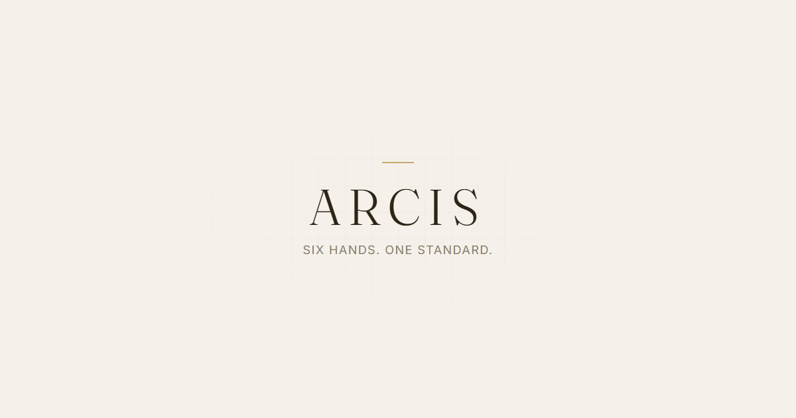

# ARCIS — Six hands. One standard.

> An immersive, scroll-driven 3D product showcase for a fictional luxury watch brand, built with Three.js and GSAP.



---

## Overview

ARCIS is a cinematic, single-page web experience that guides the user through eight scroll-driven sections, each revealing a different aspect of a luxury watch collection. The camera animates through precise keyframe paths as the user scrolls, 3D models crossfade in and out, and the lighting rig updates per-section — all orchestrated by a unified `SceneManager`.

The project is a pure-frontend showcase (no backend, no framework) built for maximum visual fidelity and smooth performance on both desktop and mobile.

---

## Features

- **Scroll-driven 3D camera** — per-section keyframe paths interpolated in real time against scroll progress
- **Dynamic lighting rig** — key, fill, and rim lights defined per section with animated sweeps
- **HDRI environment** — HDR image-based lighting for realistic reflections on watch surfaces
- **Model carousel** — the "Collection" section arranges all six watches in a 3D carousel with interactive orbit controls
- **Cross-fade transitions** — models dissolve in/out between sections using opacity tweens
- **Animated wave grid** — a canvas-drawn interactive wave mesh in the background responds to cursor movement
- **Cursor parallax** — subtle camera offset driven by mouse position for a living-world feel
- **Premium loader screen** — tracks GLB and HDRI asset loading with a branded progress animation
- **Section navigation** — burger-menu overlay lists all named sections for quick jumping
- **DRACO compression** — all `.glb` models use Draco compression for fast loads
- **Responsive** — separate mobile camera keyframes and pixel-ratio capping for mobile performance
- **Reduced-motion support** — respects `prefers-reduced-motion` throughout all GSAP timelines

---

## Tech Stack

| Layer | Library / Tool |
|---|---|
| 3D rendering | [Three.js](https://threejs.org/) v0.185 |
| Animation | [GSAP](https://gsap.com/) v3.15 |
| Build tool | [Vite](https://vitejs.dev/) v8 |
| Fonts | Fraunces (display), Inter (body), Galindo (hero accent) |
| Model compression | Draco (via Google CDN decoder) |
| Debug GUI | [lil-gui](https://lil-gui.georgealways.com/) |


---

## Project Structure

```
arcis/
+-- public/
¦   +-- models/              # DRACO-compressed GLB watch models (model1–model6.glb)
¦   +-- hdri/                # HDR environment maps
¦   +-- favicon.svg / .png
¦   +-- apple-touch-icon.png
¦   +-- og-image.png
¦
+-- src/
¦   +-- main.js              # Entry point — bootstraps loader, waves, scene, nav
¦   ¦
¦   +-- scene/
¦   ¦   +-- SceneManager.js  # Root orchestrator: renderer, RAF loop, resize, scroll
¦   ¦   +-- ModelManager.js  # GLB loading, caching, transitions, carousel, float
¦   ¦   +-- CameraRig.js     # Camera keyframe interpolation per section
¦   ¦   +-- LightingRig.js   # Per-section key/fill/rim light management + sweeps
¦   ¦
¦   +-- sections/
¦   ¦   +-- sectionConfig.js     # Single source of truth for all 8 section definitions
¦   ¦   +-- SectionController.js # Scroll-to-section mapping + EventBus dispatch
¦   ¦   +-- CopyController.js    # Text/copy animation per section (GSAP)
¦   ¦
¦   +-- ui/
¦   ¦   +-- LoaderScreen.js  # Asset preloader with branded progress UI
¦   ¦   +-- NavController.js # Burger menu + section overlay navigation
¦   ¦
¦   +-- utils/
¦   ¦   +-- Waves.js          # Canvas wave grid animation (cursor-interactive)
¦   ¦   +-- CursorParallax.js # Mouse-driven camera offset
¦   ¦   +-- EventBus.js       # Minimal pub/sub for cross-module communication
¦   ¦   +-- reducedMotion.js  # prefers-reduced-motion query helper
¦   ¦
¦   +-- styles/
¦       +-- tokens.css  # Design tokens: colors, type scale, spacing, motion, z-index
¦       +-- base.css    # CSS reset + base element styles
¦       +-- layout.css  # Section layout, navbar, overlays
¦       +-- loader.css  # Loader screen styles
¦
+-- index.html       # App shell with all 8 sections pre-rendered as HTML
+-- vite.config.js
+-- package.json
```

---

## Sections

The experience is divided into **8 named sections**, each defined in `sectionConfig.js`:

| # | ID | Name | Description |
|---|---|---|---|
| 0 | `00` | **Hero** | Brand intro with scale-in model animation and floating idle |
| 1 | `01` | **Precision** | Close-up camera push into movement detail |
| 2 | `02` | **The Line** | Horizontal camera sweep across three watch variants |
| 3 | `03` | **Material Study** | Extreme macro zoom into sapphire crystal surface |
| 4 | `04` | **Kindred Forms** | Two watches side-by-side, "designed to be worn in pairs" |
| 5 | `05` | **The Detail** | Pull-focus on the crown, slow rack from wide to close |
| 6 | `06` | **The Collection** | All six watches in a 3D carousel with interactive navigation |
| 7 | `07` | **Closing** | Brand sign-off with full wordmark and footer navigation |

Each section config entry defines:

- **Camera keyframes** — `[progress, position, target, fov]` tuples (with optional mobile overrides)
- **Models** — which GLB slots to load, their position, scale, and behaviour flags (`float`, `rotY`, `parallax`, `carousel`, `visibleAt`)
- **Lighting** — `envIntensity` + key / fill / rim light positions, intensities, colors, and optional sweep destinations
- **Duration** — scroll distance in virtual pixels the section spans

---

## Getting Started

### Prerequisites

- [Node.js](https://nodejs.org/) 18+
- npm

### Install

```bash
npm install
```

### Development

```bash
npm run dev
```

Starts the Vite dev server at `http://localhost:5173` with HMR.

### Build

```bash
npm run build
```

Outputs the production bundle to `dist/`.

### Preview Production Build

```bash
npm run preview
```

---

## Architecture Notes

### Scroll Driver
`SceneManager` listens to `window.scroll` and maps the cumulative scroll position against each section's `duration` to produce a normalised `[0, 1]` progress value. This drives both the camera keyframe interpolation (`CameraRig`) and text copy animations (`CopyController`) simultaneously.

### Model Slots
`ModelManager` uses a named **slot** system (`a`–`f`). Each section requests models by slot; if the same slot + file was loaded in a previous section it is pulled from an in-memory `Map` cache — no re-download. Transitioning between sections fades old slot meshes out while new ones fade in, enabling seamless crossfades without scene graph thrashing.

### EventBus
A tiny pub/sub (`EventBus`) decouples the scroll controller from the camera, lighting, copy, and nav modules. Sections emit a `section:change` event; subscribers react independently with no direct coupling.

### Reduced Motion
`reducedMotion.js` returns a boolean from `window.matchMedia('(prefers-reduced-motion: reduce)')`. All GSAP durations and wave amplitudes clamp to near-zero when `true`, keeping the experience accessible without a separate code path.

---

## Design Tokens

All visual constants live in `tokens.css` as CSS custom properties:

| Group | Examples |
|---|---|
| Colors | `--color-champagne`, `--color-bone`, `--color-umber-ink` |
| Typography | `--font-display` (Fraunces), `--font-body` (Inter) |
| Spacing | `--section-padding-*`, `--navbar-height` |
| Motion | `--ease-standard`, `--duration-standard` |
| Z-index | `--z-bg`, `--z-canvas`, `--z-overlay`, `--z-navbar` |

---

## License

This project is a personal creative/portfolio build. All watch model assets are original works created for this project.
